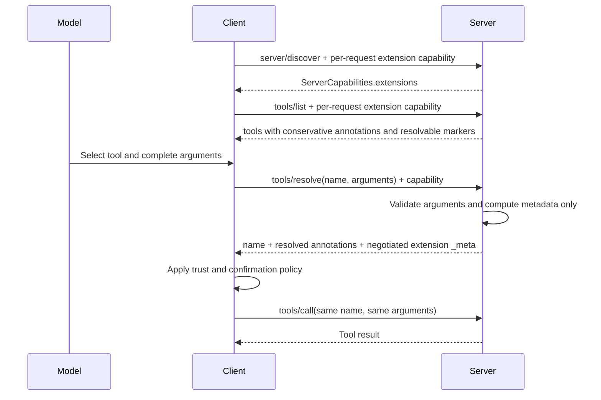

<Info>**Protocol Revision**: draft</Info>

**Extension identifier:** `io.modelcontextprotocol/tool-resolution`

> ⚠️ **Experimental draft.** This extension adapts
> [SEP-1862: Tool Resolution](https://github.com/modelcontextprotocol/modelcontextprotocol/pull/1862)
> from a proposed core method into an optional extension using the negotiation
> framework established by
> [SEP-2133](https://github.com/modelcontextprotocol/modelcontextprotocol/blob/main/seps/2133-extensions.md).

## Abstract

Tool definitions returned by `tools/list` are static, but the behavior of a tool
can depend on its arguments. A multi-action file tool may read, append, replace,
or delete; its static `ToolAnnotations` must conservatively describe the most
risky possibility, which can cause confirmation fatigue for safe calls.

This extension lets a client submit the exact intended tool name and arguments
to an extension-defined `tools/resolve` method before `tools/call`. The server
returns argument-specific behavior annotations and metadata owned by other
negotiated extensions, without executing the tool or replacing any part of its
identity or schemas.

The extension is optional. A core MCP client can ignore it and call every tool
using the static `tools/list` definition.

## Motivation

Static annotations force a versatile tool to advertise its worst case:

| Action    | Effective annotations                           |
| :-------- | :---------------------------------------------- |
| `read`    | `readOnlyHint: true`, `destructiveHint: false`  |
| `append`  | `readOnlyHint: false`, `destructiveHint: false` |
| `replace` | `readOnlyHint: false`, `destructiveHint: true`  |
| `delete`  | `readOnlyHint: false`, `destructiveHint: true`  |

Without resolution, every call must be treated like `delete`. Splitting each
action into a separate tool avoids the ambiguity but produces near-duplicate
definitions, consumes model context, and fragments one conceptual API.

Resolution preserves a conservative static declaration for registries, older
clients, and failure cases while allowing supporting clients to make better
per-call decisions. The same exchange can carry metadata from other negotiated
extensions, such as argument-specific authorization requirements or cost
estimates, without permitting the response to mutate the selected tool.

## Dependencies and naming

This extension depends on:

- Core `tools/list`, `tools/call`, `Tool`, `ToolAnnotations`, and `_meta`.
- `ClientCapabilities.extensions` and `ServerCapabilities.extensions` from the
  MCP extension framework.
- For the current draft protocol, the per-request request metadata and
  `server/discover` behavior introduced by stateless MCP.

`tools/resolve` is an **extension-defined custom method**, not a core MCP
method. The name is retained from SEP-1862 because it resolves metadata for the
core tool primitive and is consistent with `tools/list` and `tools/call`.
Implementations MUST NOT assume that the method exists without the extension
capability described below.

## Negotiation

### Current draft protocol

The client MUST advertise support on every request for which it expects Tool
Resolution behavior:

```json
{
  "_meta": {
    "io.modelcontextprotocol/protocolVersion": "2026-07-28",
    "io.modelcontextprotocol/clientCapabilities": {
      "extensions": {
        "io.modelcontextprotocol/tool-resolution": {}
      }
    }
  }
}
```

This includes `tools/list` requests that expect resolvable markers and every
`tools/resolve` request. A server MUST evaluate the capability on the current
request and MUST NOT infer it from `server/discover` or any earlier request.

A supporting server advertises:

```json
{
  "capabilities": {
    "tools": {},
    "extensions": {
      "io.modelcontextprotocol/tool-resolution": {}
    }
  }
}
```

Clients MAY obtain these capabilities through `server/discover`. Discovery is an
optimization; the client still declares its own support on the `tools/resolve`
request.

### Legacy session protocol

When using a protocol revision with the `initialize` handshake, the client and
server advertise the same empty settings object under
`ClientCapabilities.extensions` and `ServerCapabilities.extensions` in the
`initialize` exchange. The per-request rule above applies whenever the
negotiated core protocol defines per-request client capabilities.

The empty object is the complete settings schema for this revision. An
implementation of this revision MUST treat a non-empty settings object as
unsupported rather than assuming compatibility with unknown required behavior.

## Marking resolvable tools

A server marks only tools whose metadata can vary by arguments:

```json
{
  "name": "manage_files",
  "inputSchema": {
    "type": "object",
    "properties": {
      "path": { "type": "string" },
      "action": {
        "type": "string",
        "enum": ["read", "append", "replace", "delete"]
      }
    },
    "required": ["path", "action"]
  },
  "annotations": {
    "readOnlyHint": false,
    "destructiveHint": true,
    "idempotentHint": false,
    "openWorldHint": false
  },
  "_meta": {
    "io.modelcontextprotocol/tool-resolution": {
      "resolvable": true
    }
  }
}
```

The marker is carried at
`Tool._meta["io.modelcontextprotocol/tool-resolution"].resolvable`, not in a new
core `Tool` field. A server MUST NOT mark a tool unless it supports
`tools/resolve` for that tool. A server SHOULD omit the marker from a
`tools/list` response when the current request does not advertise this
extension.

Static annotations remain the conservative fallback. For every valid argument
set:

- `readOnlyHint: true` in `tools/list` means every resolution MUST also be
  read-only.
- `destructiveHint: false` for a non-read-only static tool means no resolution
  may be destructive.
- `idempotentHint: true` means every non-read-only resolution MUST also be
  idempotent.
- `openWorldHint: false` means no resolution may become open-world.

The core defaults apply before evaluating these rules. Other extensions that put
resolvable data in the result `_meta` MUST define their own conservative
fallback relationship.

## `tools/resolve`

### Request

```json
{
  "jsonrpc": "2.0",
  "id": 1,
  "method": "tools/resolve",
  "params": {
    "name": "manage_files",
    "arguments": {
      "path": "/home/user/notes.txt",
      "action": "read"
    },
    "_meta": {
      "io.modelcontextprotocol/protocolVersion": "2026-07-28",
      "io.modelcontextprotocol/clientCapabilities": {
        "extensions": {
          "io.modelcontextprotocol/tool-resolution": {}
        }
      }
    }
  }
}
```

| Field       | Required              | Description                                                                                                                                                                           |
| :---------- | :-------------------- | :------------------------------------------------------------------------------------------------------------------------------------------------------------------------------------ |
| `name`      | yes                   | Tool name exactly as returned by `tools/list`.                                                                                                                                        |
| `arguments` | yes                   | Complete JSON object intended for the subsequent `tools/call`; use `{}` for a no-argument tool.                                                                                       |
| `_meta`     | current protocol: yes | Core per-request metadata, including current protocol version and this client capability. It is omitted only for a legacy session that negotiated the extension through `initialize`. |

Partial arguments are not supported. A client that changes the name or any
argument after resolution MUST resolve again before relying on the metadata.

### Result

```json
{
  "jsonrpc": "2.0",
  "id": 1,
  "result": {
    "resultType": "complete",
    "name": "manage_files",
    "annotations": {
      "readOnlyHint": true,
      "destructiveHint": false,
      "idempotentHint": true,
      "openWorldHint": false
    }
  }
}
```

| Field         | Required | Description                                                                                                                                                 |
| :------------ | :------- | :---------------------------------------------------------------------------------------------------------------------------------------------------------- |
| `resultType`  | yes      | Core result discriminator. MUST be `"complete"`.                                                                                                            |
| `name`        | yes      | Stable correlation field; MUST equal the requested tool name.                                                                                               |
| `annotations` | yes      | Complete effective values for the four resolvable core behavior hints.                                                                                      |
| `_meta`       | no       | Core result metadata plus objects owned by other extensions negotiated on this request. Unrecognized or unnegotiated extension keys are ignored by clients. |

`annotations.title` is deliberately absent. Human-readable title, tool name,
description, icons, input schema, and output schema remain authoritative from
`tools/list`.

### Immutable and resolvable surfaces

| Surface                         | Source of truth                            | Resolution behavior                                                  |
| :------------------------------ | :----------------------------------------- | :------------------------------------------------------------------- |
| `name`                          | `tools/list`                               | Returned unchanged only for correlation; MUST NOT redefine identity. |
| `title`, `description`, `icons` | `tools/list`                               | MUST NOT be returned or changed.                                     |
| `inputSchema`, `outputSchema`   | `tools/list`                               | MUST NOT be returned or changed.                                     |
| Four core behavior hints        | `tools/resolve.result.annotations`         | Complete per-call replacement when resolution succeeds.              |
| Other extension metadata        | `tools/resolve.result._meta[extension-id]` | Allowed only for extensions negotiated on the current request.       |

This dedicated result resolves the review concern raised on SEP-1862: a full
replacement `Tool` could change `inputSchema` after the client had already
selected arguments. No replacement `Tool` exists in this extension.

## Behavior

### Server requirements

1. The server MUST verify the extension capability on the current request.
2. The server MUST reject an unknown or unmarked tool.
3. The server MUST validate `arguments` against the authoritative `tools/list`
   `inputSchema` before resolution and SHOULD apply the same additional
   validation used by `tools/call`.
4. The server MUST treat the supplied arguments as immutable input. It MUST NOT
   add defaults, normalize values, or silently resolve a different call.
5. The server MUST return all four boolean fields in `annotations`.
6. The server MUST preserve the conservative relationship with the static
   annotations.
7. The server MUST NOT execute the tool or cause externally observable side
   effects. Resolution MUST NOT write data, send messages, charge accounts,
   acquire durable locks, initiate authentication, prompt a user, or reserve
   capacity. Reads needed to classify the intended call are allowed.
8. Resolution SHOULD be materially cheaper than execution. If accurate metadata
   requires performing the operation, the server MUST return an error and retain
   the static fallback.
9. The server MUST emit extension-owned result `_meta` only for extensions
   advertised by the client on the current request. Core result metadata, such
   as `io.modelcontextprotocol/serverInfo`, follows the core protocol and is not
   subject to extension negotiation.

### Client requirements

1. The client MUST use the same tool name and structurally equal JSON arguments
   for `tools/resolve` and the subsequent `tools/call`.
2. The client MUST retain identity, schemas, descriptions, titles, and icons
   from `tools/list`.
3. On successful resolution, the client MUST use the returned four behavior
   hints for decisions about that call. Static `annotations.title` remains in
   effect.
4. A client MAY skip resolution when it will not use pre-execution metadata.
   Skipping MUST NOT make the core tool unusable.
5. The client MUST treat malformed results, name mismatches, and
   conservative-bound violations as resolution failures. It MUST ignore
   unrecognized or unnegotiated extension `_meta` keys while retaining valid
   core result metadata.
6. The client MUST NOT call `tools/call` after an invalid-arguments error
   without correcting the arguments.

## Fallback and errors

| Code                                        | Condition                                                                        | Client behavior                                            |
| :------------------------------------------ | :------------------------------------------------------------------------------- | :--------------------------------------------------------- |
| `-32601` Method not found                   | Server does not implement the extension method.                                  | Use static annotations.                                    |
| `-32021` Missing required client capability | Current request omitted the extension capability.                                | Correct negotiation; do not infer prior state.             |
| `-32602` Invalid params                     | Unknown tool, unmarked tool, incomplete arguments, or schema validation failure. | Correct the request; do not execute unchanged arguments.   |
| `-32603` Internal error                     | Resolver could not compute trustworthy metadata.                                 | Use static annotations or abort according to local policy. |

If the server does not advertise support, the tool is unmarked, resolution is
skipped, or a non-argument resolution error occurs, the client uses the
`tools/list` annotations with normal core defaults. Lack of this extension never
disables `tools/call`.

Static metadata is the conservative fallback, not an assertion that resolution
will succeed. A client MAY choose to abort instead of falling back when its
local policy requires argument-specific metadata.

## Caching, staleness, and TOCTOU

A resolution is a point-in-time advisory for one immediate call. This revision
defines no cache-control field:

- Clients MUST NOT reuse a result for different arguments or a later call.
- Clients SHOULD resolve as late as practical, after arguments are final.
- Any `tools/list_changed` event or refreshed tool definition invalidates
  outstanding resolutions for that tool.
- Servers MAY consult changing state while resolving, so identical requests are
  not required to produce identical metadata indefinitely.

Resolution does not reserve state, authorize execution, or make the subsequent
call atomic. Files, permissions, prices, remote resources, and policy may change
between resolution and execution. Clients MUST NOT treat a successful result as
proof that the call will succeed or remain safe. Servers MUST enforce all
authorization and validation again during `tools/call`.

## Trust model

Resolved annotations are server claims with the same trust level as static
`ToolAnnotations`. Tool Resolution improves precision from honest servers; it
does not make annotations enforceable and does not protect against a malicious
or compromised server.

Clients MUST treat resolved metadata as untrusted unless the server is trusted,
MUST apply local policy independently, and MUST NOT use resolution as a
substitute for sandboxing, authorization, audit, or user consent.

## Message flow



## Reference implementation and schemas

The repository includes:

- TypeScript wire types in `src/spec.types.ts`.
- A metadata-only server registry and client fallback helper in
  `src/reference.ts`.
- A runnable `manage_files` example in `examples/manage-files.ts`.
- Wire examples in `examples/wire/`.
- Generated JSON Schema at `schema/tool-resolution.schema.json`.
- Generated type documentation at `docs/generated/tool-resolution-types.md`.

Run `npm run check` to regenerate artifacts, type-check, run tests,
format-check, and execute the example.

## Relationship to other extensions

Tool Resolution does not depend on `trust-annotations` or `action-metadata`.
Those extensions remain independently useful with static metadata. A future
revision of another extension MAY define an object under
`ResolveToolResult._meta[its-extension-identifier]`, including its conservative
fallback and trust semantics.

This keeps one pre-execution exchange without returning an open-ended
replacement `Tool`.

## Changelog

| Date       | Change                                                                                                                          |
| :--------- | :------------------------------------------------------------------------------------------------------------------------------ |
| 2026-08-20 | Initial experimental extension draft, adapted from SEP-1862 with per-request capability negotiation and a metadata-only result. |
